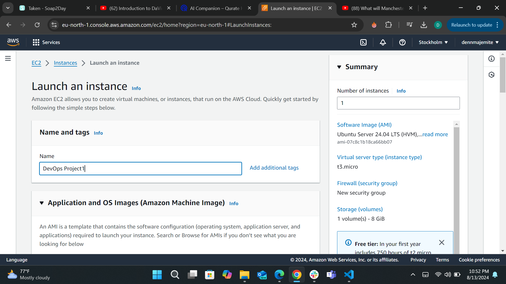

# Setup A Static Website Using Nginx

Welcome to your first project. Get to lauch your very own static website. In this project you will be:

- **Building with Nginx:** We'll set up Nginx as your webserver, the engine that delivers your website content to the world.
- **Connecting with Route53:** You'll learn how to configure amazon route53, The DNS service that directs visitors to your website's location.
- **Securing with certbot:** We'll implement HTTPS encryption using certbot, ensuring a safe and secure connection for your website

By the end of this project, you would have fully deployed a static website ready to share with the world!

> [!NOTE]
An AWS account is needed to carry out this project so ensure that you get one

## Introduction

Before we begin this project, let's review some of the key concept and task we would be tackling.

### Nginx 
Nginx (also pronounced as "engine X") is a high performance web server and reverse proxy server that is widely used for serving static content, load balancing and handling reverse proxy task. It is known for its speed, stability and low resource consumption, making it an excellent choice for high traffic websit. Nginx can also be used as an HTTP Cache, an email proxy server, and a load balancer for HTTP, TCP, and UDP traffic. its flexibility and scalability make it a popular choice amongst developers and system admins

### Route53

Amazon Route 53 is a scalable and highly available Domain Name System (DNS) web service offered by Amazon Web Services (AWS). It is designed to route end-user requests to internet applications by translating human-readable domain names (like www.example.com) into IP addresses that computers use to connect to each other. Route 53 also allows you to:

- **Register Domain Names**: You can purchase and manage domain names directly through Route 53.
- **DNS Routing**: You can configure various routing policies, including simple, weighted, latency-based, failover, and geolocation routing to direct traffic based on different criteria.
- **Health Checks and Monitoring**: Route 53 can monitor the health of your web applications and automatically route traffic to healthy endpoints.
- **Integration with Other AWS Services**: It seamlessly integrates with other AWS services, making it easier to manage your infrastructure and improve application performance and reliability.

Route 53 is designed to provide developers and businesses with an extremely reliable and cost-effective way to route end users to internet applications.

### Certbot

Certbot is an open-source tool for automating the process of obtaining and renewing SSL/TLS certificates from the Let's Encrypt Certificate Authority (CA). These certificates are used to enable HTTPS on websites, which encrypts data transmitted between the server and the client's browser, enhancing security.

#### Key Features of Certbot:

- **Automated Certificate Management**: Certbot can automatically obtain and install certificates on your server.
- **Renewal Automation**: It can automatically renew certificates before they expire, ensuring continuous security.
- **Compatibility**: Certbot supports a wide range of web servers, including Apache and Nginx.
- **Ease of Use**: It simplifies the process of switching from HTTP to HTTPS by handling most of the complex details for you.

#### How Certbot Works:

1. **Install Certbot**: Install Certbot on your server.
2. **Obtain a Certificate**: Use Certbot to request a certificate from Let's Encrypt. Certbot will verify that you control the domain for which you are requesting the certificate.
3. **Install the Certificate**: Certbot can automatically configure your web server to use the new certificate.
4. **Renewal**: Certbot will periodically check for expiring certificates and renew them automatically.

Certbot is widely used because it provides a straightforward and automated way to improve web security with minimal effort.

---

## Project 1

|S/N | Project Tasks                                                                   |
|----|---------------------------------------------------------------------------------|
| 1  |Buy a domain name from a domain Registrar                                        |
| 2  |Spin up an Ubuntu server & assign an elastic IP to it                            |
| 3  |SSH into the server and install Nginx                                            |
| 4  |Download freely HTML website files(too plate) or use your personal code          |
| 5  |Copy the website files to the Nginx website directory                            |
| 6  |Validate the website using the server IP address                                 |
| 7  |In Route53, create an A record and add the Elastic IP                            |
| 8  |Using DNS verify the website setup                                               |
| 9  |Install certbot and Request For an SSL/TLS Certificate                           |
| 10 |Validate the website SSL using the OpenSSL utility                               |

## Key Concepts Covered

- AWS (EC2 and Route 53)
- EC2
- Linux(Ubuntu)
- Nginx
- DNS
- SSL (certbot)
- OpenSSL command

## Checklist

- [x] Task 1: Buy a domain name from a domain Registrar.
- [x] Task 2: Spin up a Ubuntu server & assign an elastic IP to it.
- [x] Task 3: SSH into the server and install Nginx.
- [x] Task 4: Find freely available HTML website files.
- [x] Task 5: Download and unzip the website files to the Nginx website directory.
- [x] Task 6: Validate the website using the server IP address.
- [x] Task 7: In Route53, create an A record and add the Elastic IP.
- [x] Task 8: Using DNS verify the website setup.
- [x] Task 9: Install certbot and Request For an SSL/TLS Certificate.
- [x] Task 10: Validate the website SSL using the OpenSSL utility.

## Documentation

### Create An Ubuntu Server

- Locate and click on **EC2** within the AWS management console.

